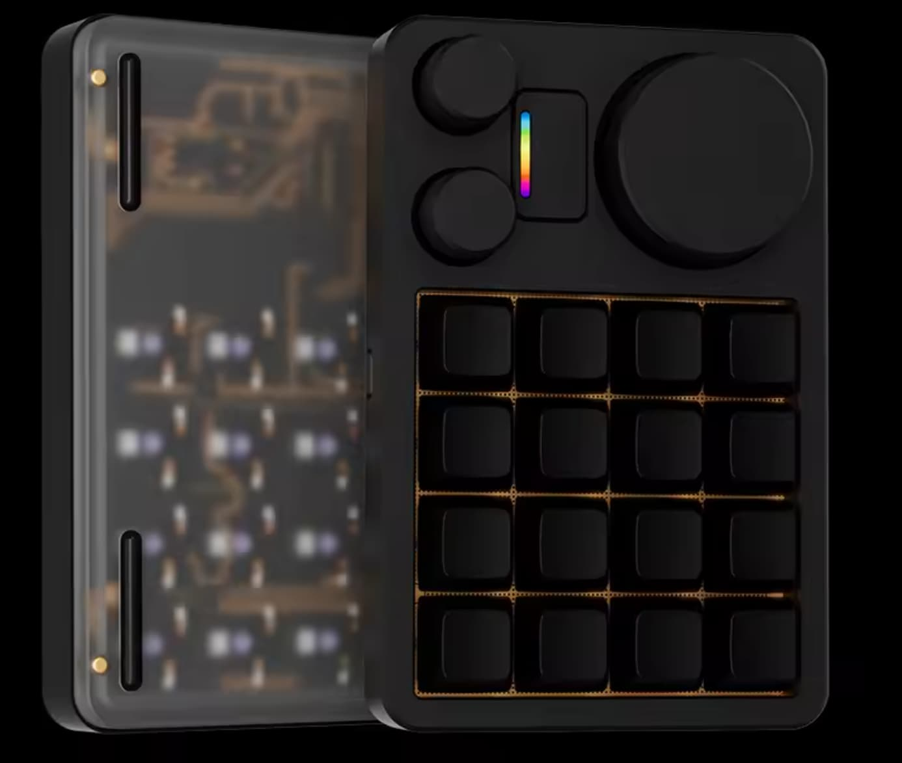

# RawMacroPad - Raw Macro Pad HID Interface

RawMacroPad is a custom RAW HID protocol for macropad keyboards.

This project provides custom firmware for supported macropads and Node.js client library
for communicating with any device that supports the protocol.

Currently, the MMD KM16 is the only supported device.  



While most of the documentation currently references just the KM16 device, the protocol itself 
is device agnostic and at some point firmware for other devices may be implemented.


## Background

The MMD-KM16 is an excellent macropad keypad controller that runs [QMK](https://qmk.fm/), appears to Windows
as a regular HID keyboard and is programmable via the well-known [VIA](https://www.usevia.app/) tool.

For most use cases it's perfectly fine.  For custom integrations however, direct RAW HID access is preferable
because it:

* Bypasses the operating system keyboard stack.
* Allows exclusive control of device from a particular application (ie: works for a dedicated app
  regardless of operating system input focus)
* Allows direct control of LED lighting without introducing flash-wear.

The project provides a custom firmware with RAW HID USB interface and a Node.js and Python client
library for interfacing with the device.

The firmware also includes an optional "watch-dog" timer that displays a flashing red indicator on the device
if no client program is connected (eg: client program crashed, OS hung, etc...).


## Disclaimer

**USE AT YOUR OWN RISK.** This software is provided without any warranty or guarantee of any kind.
The authors take no responsibility for any damage, including but not limited to bricked devices,
that may result from using this firmware.

This project was developed through reverse engineering of a specific MMD-KM16 device. There is no
guarantee that other devices sold under the same or similar branding will have identical hardware,
bootloaders, or behavior. Variations in manufacturing, hardware revisions, or regional differences
may cause this firmware to be incompatible with or damaging to your device.

Before flashing, ensure you have backed up your original firmware and understand the risks involved.

## RawMacroPad Protocol Spec

The RawMacroPad protocol follows the standard RAW HID convention of 64-byte packets sent both
from the device to host and host to device.

RawMacroPad devices have VID/PID of 0x1209/0x88BF (registered via pid-codes)

The following packets are defined:

### Device to Host

Key Press Event:

```
packet[0] = 0x01
packet[1] = key index
packet[2] = 1 for press, 0 for release
```

Encoder Event:

```
packet[0] = 0x02
packet[1] = encoder index
packet[2] = signed char direction (-1 or 1)
```

### Host to Device

**Note: when sending packets using node_hid the first byte is always zero, but the device receieves from byte 1 onwards which is what's documented here**

Set Watchdog Timer and Ping 

(device enters error mode if another set/ping event not received before the time out).

```
packet[0] = 0x01
packet[1] = MSB ping interval in milliseconds 
packet[2] = MSB ping interval in milliseconds 
```

Enable All LEDs

```
packet[0] = 0x02
packet[1] = non-zero to enable, zero to disable
```

Enable LED Chain

```
packet[0] = 0x03
packet[1] = led chain index
packet[2] = non-zero to enable, zero to disable
```

Set LED Chain to Single Color

```
packet[0] = 0x04
packet[1] = led chain index
packet[2] = R byte
packet[3] = G byte
packet[4] = B byte
```

Set LED Chain

```
packet[0] = 0x05
packet[1] = led chain index
packet[2,3,4] = RGB for led 0
packet[5,6,7] = RGB for led 1
etc...
```

Set Individual LED

```
packet[0] = 0x06
packet[1] = led chain index
packet[2] = led index
packet[3] = R byte
packet[4] = G byte
packet[5] = B byte
```

Reset Device

```
packet[0] = 0xFF
```


## KM16 Protocol Mapping

The KM16 is mapped to the protocol as follows:

* Main Key Pad Keys - key indicies 0-15 (from top-left to bottom-right in RTL order)
* Main Encoder - key index 16
* Small Left Encoder - key index 17
* Small Right Encoder - key index 18

For encoders, the same index is used for both push button press/release events and the encoder turn events.

* LED Chain 0 - under-key LEDs - total 16 same numbering as key press indicies
* LED Chain 1 - under-glow LEDs - total 6
* LED Chain 2 - layer indicator LED - total 1.

Notes the layer indicator LED:

* only supports 1 bit color which is mapped from the most-significant bit of each of the RGB component values
* doesn't support enable LED chain functionality


## Hardware Spec

There is no public official hardware specification for the KM16 however the device has been
reverse engineered and documented in the file [km16_hardware_spec.md](./notes/km16_hardware_spec.md).


## Firmware Implementation

The firmware is implemented as an Arduino sketch in the [firmware](./firmware/) folder.

The firmware is mostly straight-forward except for the custom USB RAW HID implementation which is
[documented here](./notes/RawHID_Implementation.md).


## Installing the Firmware

### Saving the Original Firmware

Before proceeding it's highly recommended to backup the device's original firmware:

1. Install [dfu-util](https://dfu-util.sourceforge.net/releases/)

2. Put the device into bootloader mode by pressing the top-left key while connecting the USB cable.

3. Optional: check the bootloader is active:

    ```
    dfu-util -l
    ```

    you should see something like:

    ```
    dfu-util 0.11

    Copyright 2005-2009 Weston Schmidt, Harald Welte and OpenMoko Inc.
    Copyright 2010-2021 Tormod Volden and Stefan Schmidt
    This program is Free Software and has ABSOLUTELY NO WARRANTY
    Please report bugs to http://sourceforge.net/p/dfu-util/tickets/

    Found DFU: [1eaf:0003] ver=0201, devnum=1, cfg=1, intf=0, path="2-3", alt=2, name="STM32duino bootloader v1.0  Upload to Flash 0x8002000", serial="LLM 003"
    Found DFU: [1eaf:0003] ver=0201, devnum=1, cfg=1, intf=0, path="2-3", alt=1, name="STM32duino bootloader v1.0  Upload to Flash 0x8005000", serial="LLM 003"
    Found DFU: [1eaf:0003] ver=0201, devnum=1, cfg=1, intf=0, path="2-3", alt=0, name="STM32duino bootloader v1.0  ERROR. Upload to RAM not supported.", serial="LLM 003"
    ```

4. Save your old firmware:

    ```
    dfu-util -d 1eaf:0003 -a 2 -U original_firmware.bin
    ```

    You will see an "Error during upload" message at the end — this is normal and expected.
    Verify the output shows "Received a total of 122880 bytes":

    ```
    dfu-util 0.11

    Copyright 2005-2009 Weston Schmidt, Harald Welte and OpenMoko Inc.
    Copyright 2010-2021 Tormod Volden and Stefan Schmidt
    This program is Free Software and has ABSOLUTELY NO WARRANTY
    Please report bugs to http://sourceforge.net/p/dfu-util/tickets/

    Opening DFU capable USB device...
    Device ID 1eaf:0003
    Device DFU version 0110
    Claiming USB DFU Interface...
    Setting Alternate Interface #2 ...
    Determining device status...
    DFU state(2) = dfuIDLE, status(0) = No error condition is present
    DFU mode device DFU version 0110
    Device returned transfer size 2048
    Copying data from DFU device to PC
    Upload  [======================== ]  99%         2048 bytes
    Error during upload (LIBUSB_ERROR_PIPE)

    Received a total of 122880 bytes
    ```

5. Check the file `original_firmware.bin` is 120KB and store it somewhere safe.


### Restoring the Original Firmware

1. Put the device into bootloader mode by pressing the top-left key while connecting the USB cable.

2. Run the following command:

    ```
    dfu-util -d 1eaf:0003 -a 2 -D original_firmware.bin
    ```


### Building and Flashing the Custom Firmware

The build process should work on any platform where arduino-cli is supported.

1. Install [arduino-cli](https://arduino.github.io/arduino-cli/latest/installation/)

2. Install the STM32 board support:

    ```
    arduino-cli config add board_manager.additional_urls https://github.com/stm32duino/BoardManagerFiles/raw/main/package_stmicroelectronics_index.json
    arduino-cli core update-index
    arduino-cli core install STMicroelectronics:stm32
    ```

3. Put the device into bootloader mode by pressing the top-left key while connecting the USB cable.

4. Build and flash the firmware.

    On Linux/macOS (or Windows with Git Bash), run the provided script:

    ```
    cd firmware/km16
    ./build-and-flash
    ```

    On other platforms, run the equivalent commands directly:

    ```
    arduino-cli compile \
        --fqbn STMicroelectronics:stm32:GenF1:pnum=BLACKPILL_F103CB,upload_method=dfu2Method,xserial=generic,usb=none \
        --export-binaries .

    dfu-util -d 1eaf:0003 -a 2 -D build/STMicroelectronics.stm32.GenF1/firmware.ino.bin
    ```

5. After flashing, the device will automatically reboot into the new firmware. The layer indicator
   LED should be flashing red, indicating the watchdog is active and no client is connected.


## Setting up Linux Permissions

To access the device from non-sudo user under Linux you need to setup a udev rule.

```
sudo cp 99-raw-macro-pad.rules /etc/udev/rules.d/
sudo udevadm control --reload-rules
sudo udevadm trigger
```


## Using the Node.js Library

The Node.js library has been tested on Windows with Node.js v22 and on 64-bit Raspian with Node.js v24.
It should work on any OS and Node.js version where [node-hid](https://github.com/node-hid/node-hid) is
supported, but this is untested.

To install the Node.js package:

```
npm install --save @toptensoftware/rawMacroPad
```

See the [example program](./node/test/test.js) for how to use it. See also the [implementation file](./node/index.js) itself.


## Using the Python Library

The python library has only been tested on Windows with Python 3.14.2.  In should work on any platform where the `hid` package
is supported.

See the [example program](./python/test/test.js) for how to use it. See also the [implementation file](./python/raw_macro_pad.py) itself.

## License

This project is licensed under the MIT License - see the [LICENSE](LICENSE) file for details.
